<h2>Management Task Application</h2>

<h3>Managing Users</h3>
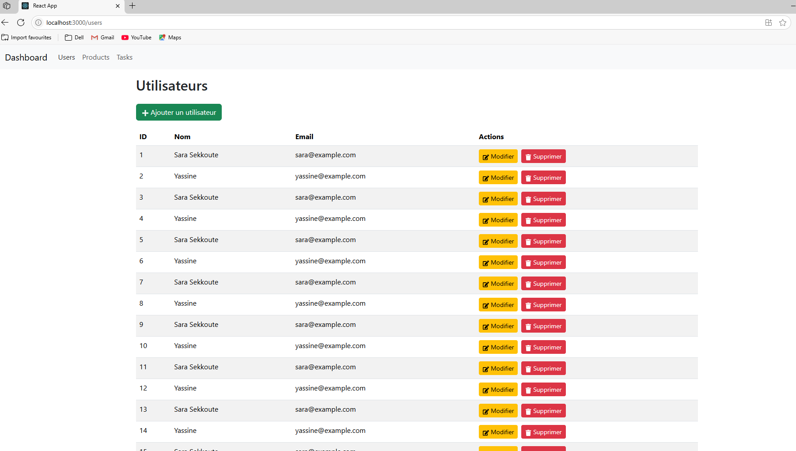
<h4>Add User</h4>
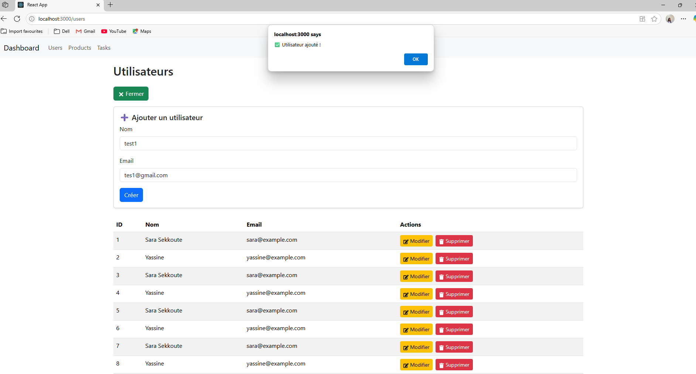
<h4>Edit User</h4>
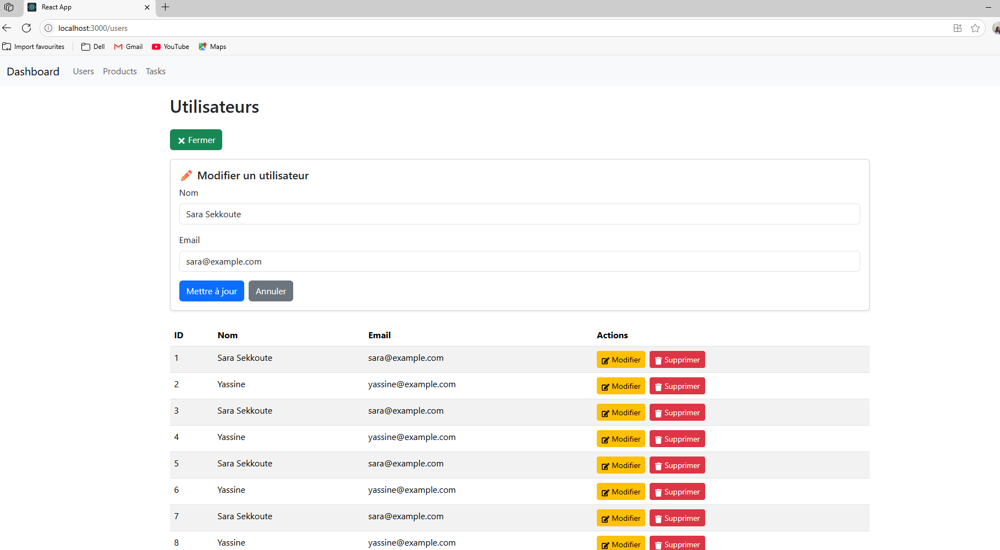
<h4>Delete User</h4>
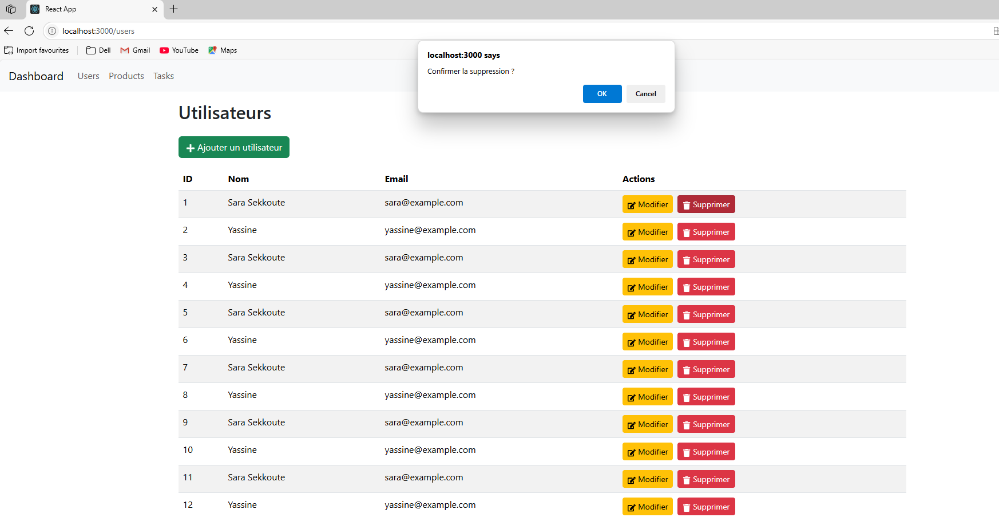

<h3>Managing Products (Same structure as Users)</h3>
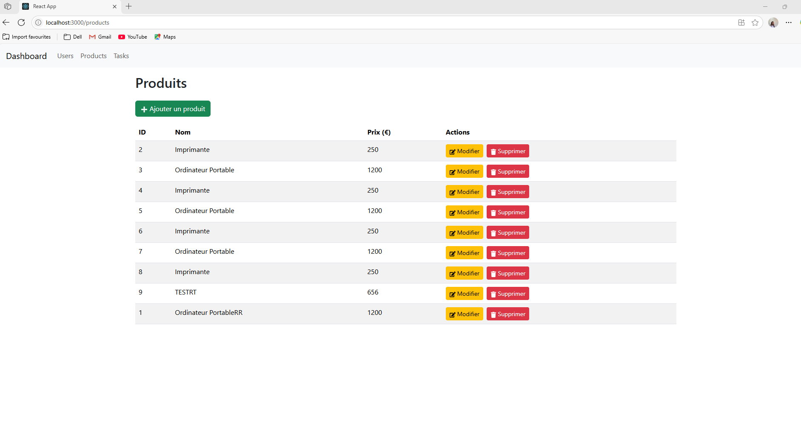
<h4>Add Product</h4>
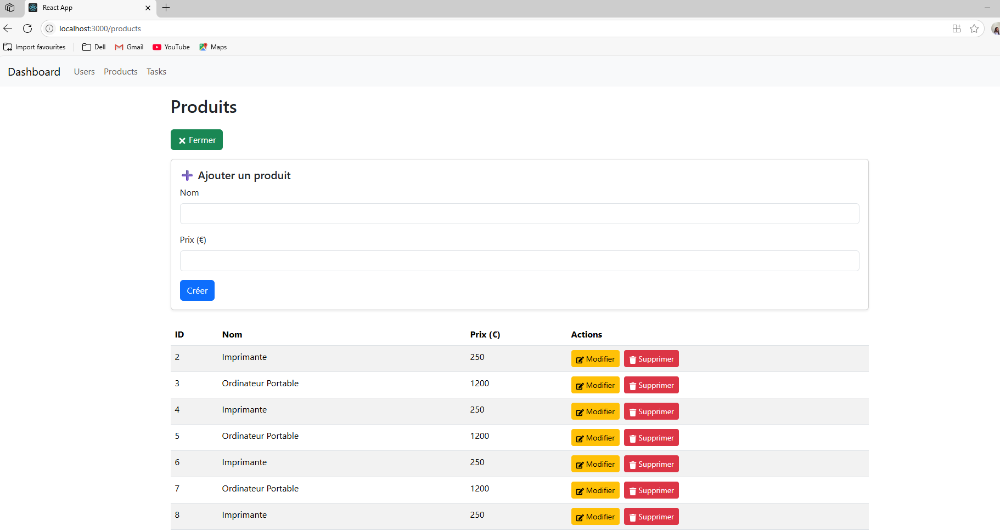
<h4>Edit Product</h4>
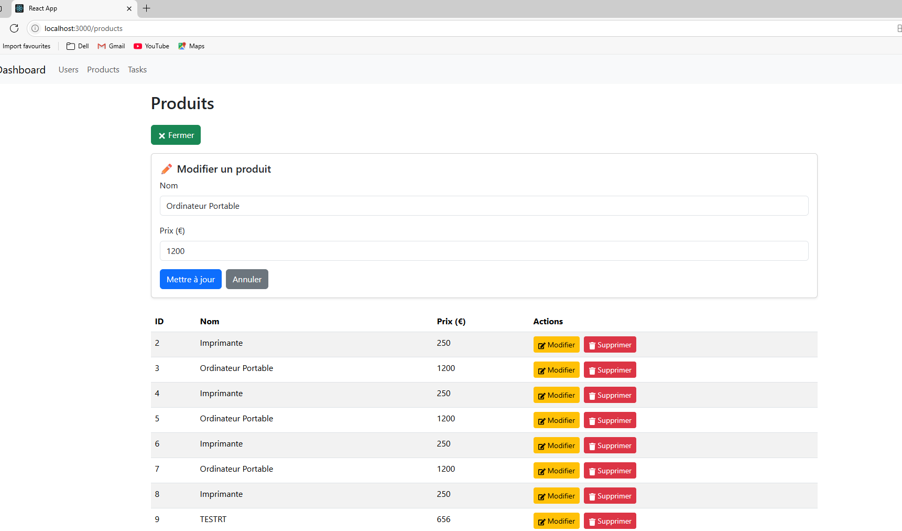
<h4>Delete Product</h4>
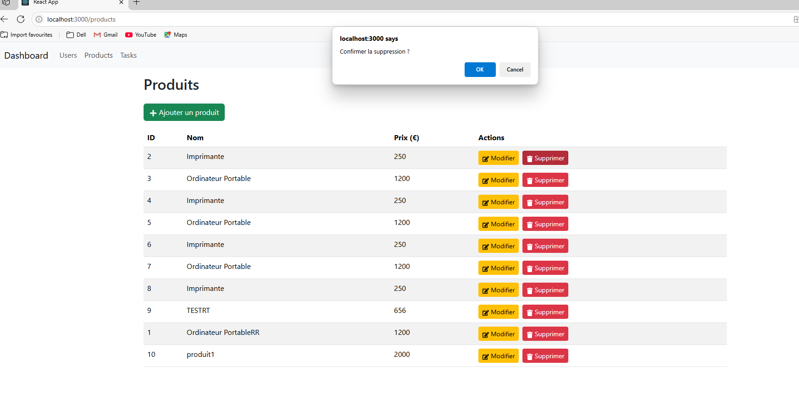

<h3>Managing Tasks</h3>
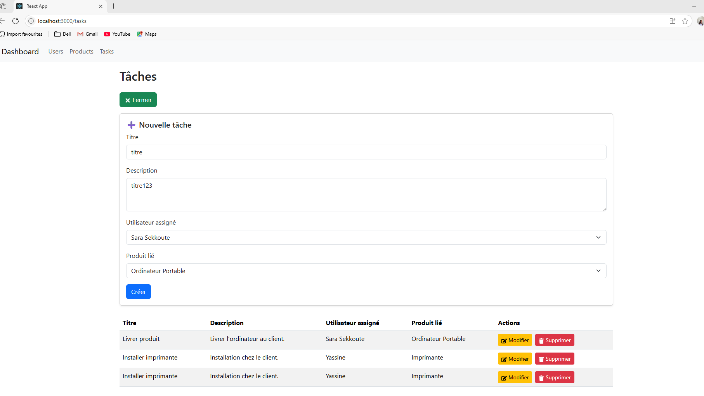
<h4>Add Task</h4>

When adding a task, the form displays already existing users and products from the database.

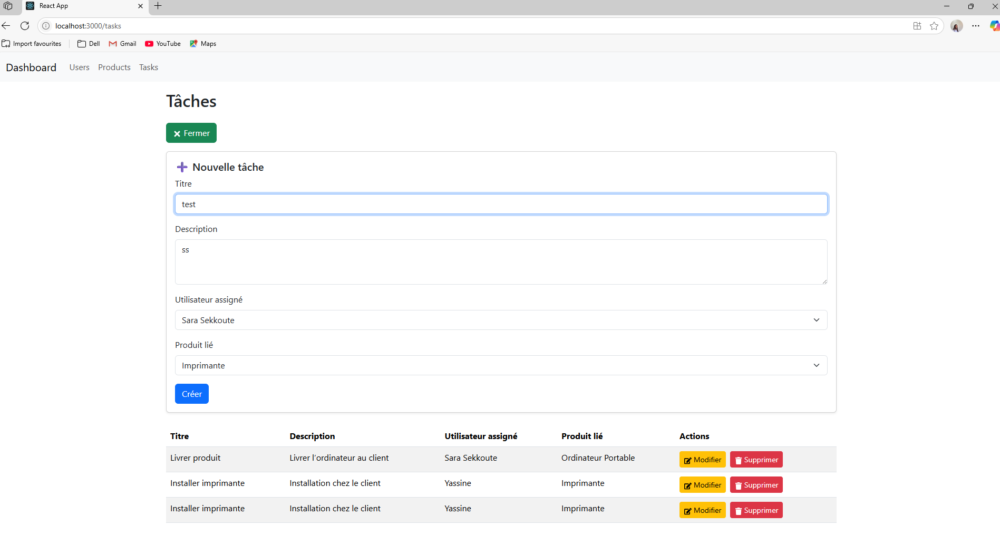
<h4>Edit Task</h4>
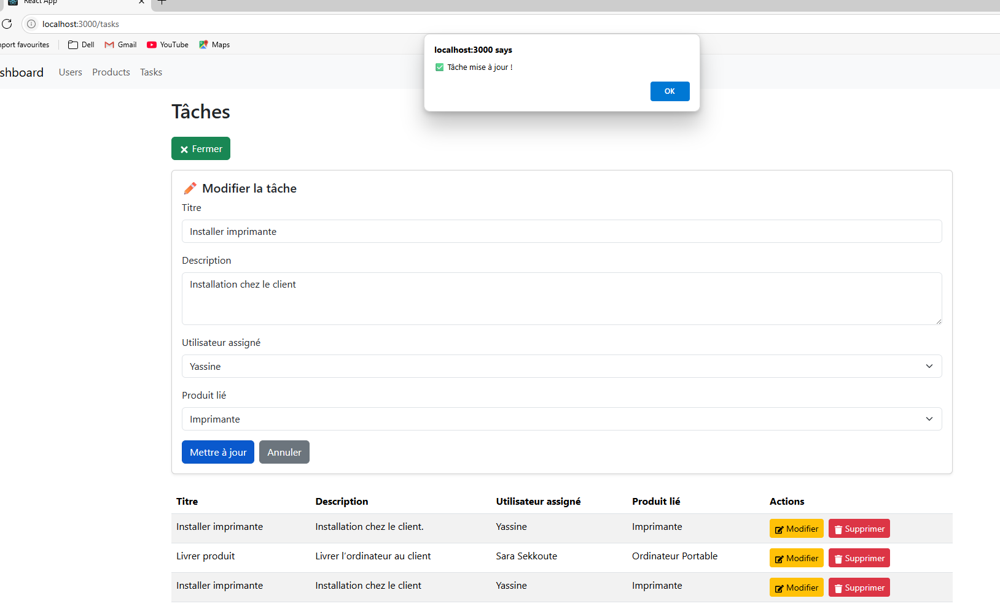
<h4>Delete Task</h4>
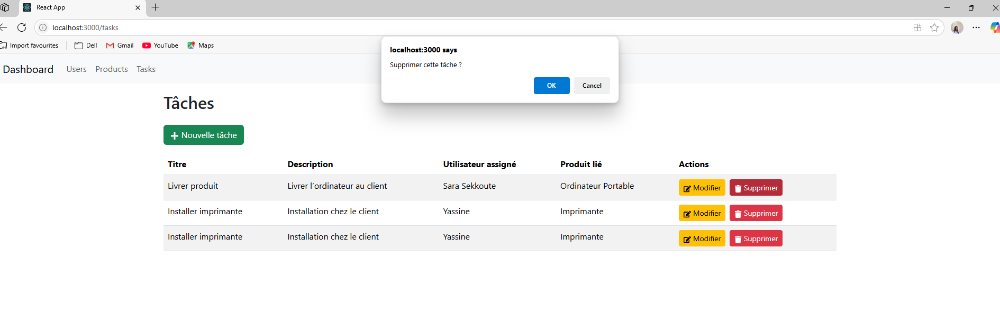
